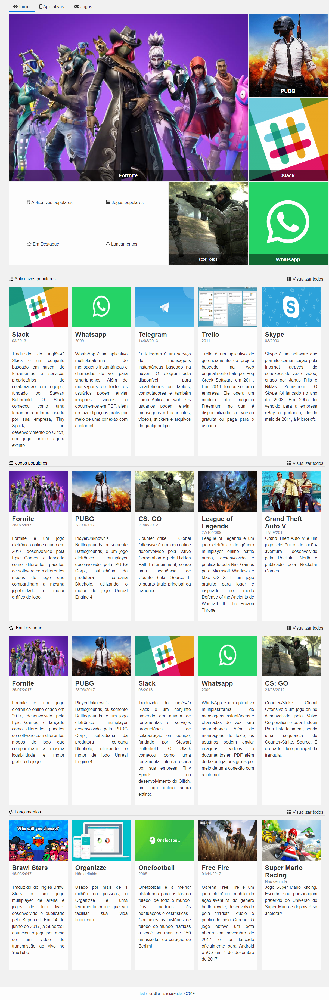

# <h1 align="center">Alura Store</h1>

 

<h2 align="center"> Imagem da página Desktop </h2>
 

 

<h2 align="center"> Imagem da página Mobile </h2>
 

 

<h2 align="center"> Descrição do Projeto </h2>
 
    Criação do site Alura Store para venda e download de aplicativos e jogos. 
     
    Projeto desenvolvido para demonstrar os conhecimentos adquiridos no curso "CSS Grid: simplificando layouts", presente no site na Alura.
 

<h2 align="center"> :hammer:  Ferramentas e Funcionalidades  :hammer: </h2>
 

 
          
<h2 align="center"> :notebook:  O que Aprendi  :notebook:</h2>

- Utilização de grid para calcular e alinhar elementos;
- Criação de templates eficazes e simples.
- Utilização de media queries para deixar site responsivo;
- Aplicação de diferentes regras para diferentes tamanhos de telas;

 
 
<h2 align="center"> :heart:  Contato  :heart:</h2>
 

regothardo@gmail.com
